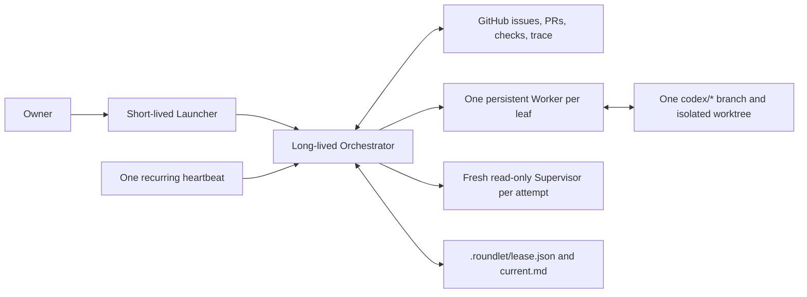
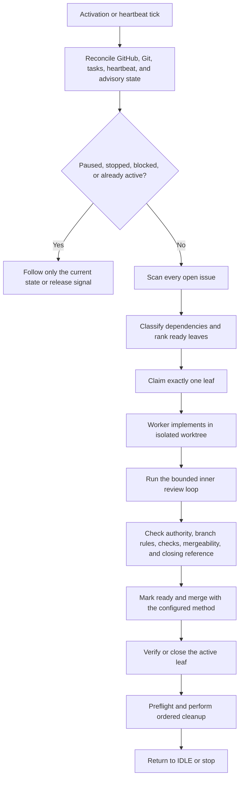
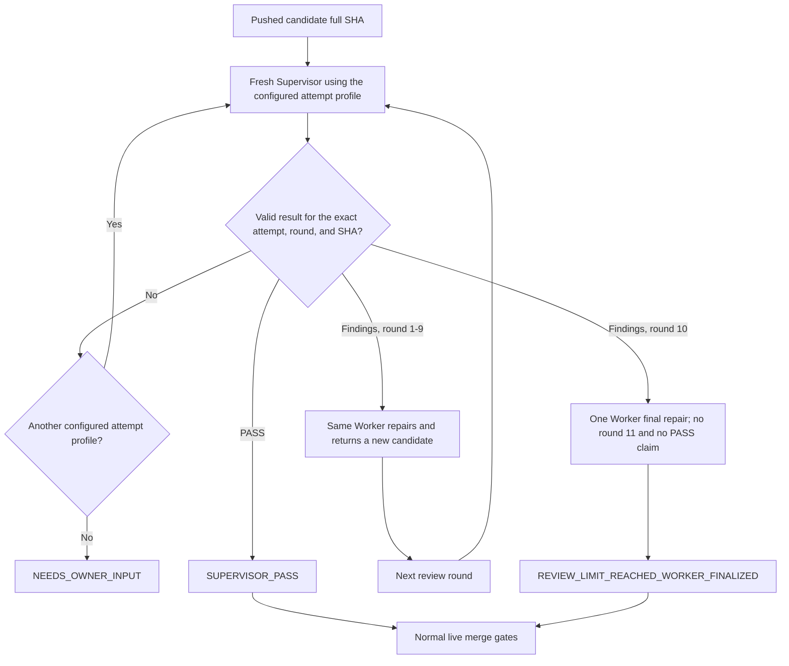

# Roundlet

Roundlet is a prompt-native Codex skill that works through one GitHub repository's issue backlog, one actionable leaf at a time. It keeps one long-lived Orchestrator, one recurring heartbeat, one persistent Worker for the active issue, and a fresh read-only Supervisor for every review attempt. It merges only when the target repository explicitly permits the required mutations, then cleans up before selecting another issue.

This README is the human-facing entry point for the source repository. It is **not** part of the installed skill. The installable source is [`skills/roundlet`](skills/roundlet), and its operating contract remains self-contained there.

## Contents

- [Understand the architecture](#understand-the-architecture)
- [Know what installation includes](#know-what-installation-includes)
- [Install on a new machine](#install-on-a-new-machine)
- [Prepare a target repository](#prepare-a-target-repository)
- [Prepare the GitHub backlog](#prepare-the-github-backlog)
- [Launch Roundlet](#launch-roundlet)
- [Operate and maintain a run](#operate-and-maintain-a-run)
- [Understand safety boundaries](#understand-safety-boundaries)
- [Contribute to Roundlet](#contribute-to-roundlet)

## Understand the architecture

Roundlet uses Codex tasks, GitHub, Git branches/worktrees, and two advisory local files. It does not ship an executable orchestration runtime, database, package, distributed lock, or CI service.



The **outer loop** schedules and completes one leaf issue before considering another:



The **inner loop** keeps the Worker but replaces the Supervisor on every attempt:



The exact invariants and round limits live in [`SKILL.md`](skills/roundlet/SKILL.md) and the [`operator guide`](skills/roundlet/references/operator-guide.md).

## Know what installation includes

Installers select the `skills/roundlet` repository path and copy that directory to the user's skills location. The repository root README, repository policy, Git history, and source-maintenance files are not installed.

```text
roundlet repository
├── README.md                         human onboarding; not installed
├── AGENTS.md                         source-repository policy; not installed
└── skills/roundlet/                  installation boundary
    ├── SKILL.md                      core safety and orchestration contract
    ├── agents/openai.yaml            skill UI metadata
    └── references/
        ├── launcher.md               activation and recovery prompts
        ├── operator-guide.md         scheduling, lifecycle, owner commands, cleanup
        ├── repository-authority.md   target-repository authority block
        ├── roundlet-config.json      exact role and run configuration
        └── thread-prompts.md         Orchestrator, Worker, and Supervisor contracts
```

Consequences:

- A root README does not affect skill discovery, triggering, or context loading.
- Do not put a README inside `skills/roundlet`.
- Anything needed while Roundlet operates must remain in `SKILL.md` or `references/`, not only here.
- The root README may explain or link to the contract, but the installed files remain authoritative for a live run.

## Install on a new machine

### 1. Confirm prerequisites

You need:

- Codex with skills, task creation/coordination, and recurring heartbeat support;
- Git and one clean authoritative checkout of the target repository;
- authenticated GitHub access that can inspect issues, pull requests, reviews, checks, mergeability, branches, and repository rules;
- the exact configured models and reasoning efforts;
- permission to add the Roundlet authority block to the target repository's root `AGENTS.md`.

Roundlet fails closed if any configured capability or mutation cannot be verified. It does not silently substitute another model, effort, Supervisor attempt profile, or merge method.

Roundlet does not require a custom Codex permission profile or project `config.toml`. When required GitHub CLI access is blocked by the network sandbox, it requires the model to request scoped escalation automatically, including through **Approve for me** when available, and distinguishes connectivity failure from a credential rejection returned by reachable GitHub. The skill cannot grant or assume network access; the host permission policy remains authoritative. Only an explicit approval denial, unavailable approval mechanism, confirmed authentication rejection, or connectivity that remains unavailable after bounded recovery blocks activation for owner input.

### 2. Choose the source you will install

The checked-in [`roundlet-config.json`](skills/roundlet/references/roundlet-config.json) contains an owner allowlist and exact model settings. Install the upstream source unchanged only when those values are correct for you.

For a durable personal or team setup:

1. Fork this repository.
2. Clone the fork.
3. Change only the configuration values you deliberately own, especially `owner_allowlist`.
4. Verify that every configured role model, reasoning effort, and ordered Supervisor attempt profile is available on the Codex host.
5. Commit and review the configuration in the fork, then install from that reviewed ref.

Copy this prompt into a Codex task opened on your fork checkout:

```text
Prepare this Roundlet source fork for my own installation.

My GitHub owner login: <GITHUB_LOGIN>
Reviewed source ref: <BRANCH_OR_FULL_COMMIT_SHA>

Read AGENTS.md, skills/roundlet/SKILL.md, and every required reference. Update
skills/roundlet/references/roundlet-config.json only for values I explicitly confirm.
Set owner_allowlist to the exact allowed GitHub login or logins. Inspect whether every
configured model, reasoning effort, and ordered Supervisor attempt profile is selectable
on this Codex host; do not substitute an unsupported value. Keep the review limits,
merge method, and heartbeat unchanged unless I explicitly approve a different exact
value. Validate the skill, JSON, YAML, links, source layout, and git diff. Do not install,
push, merge, publish, tag, or release anything in this task.
```

### 3. Install only the skill directory

Start a new Codex task and use the built-in skill installer. Replace the placeholders with the repository and reviewed ref you selected:

```text
Use $skill-installer to install the Roundlet skill from GitHub repository
<OWNER/REPOSITORY>, path skills/roundlet, at reviewed ref <BRANCH_OR_FULL_COMMIT_SHA>.
Install only that skill path, not the repository root. Report the final installed skill
directory and whether Codex needs to restart before Roundlet appears. Do not change the
source repository or a target repository.
```

The installed directory is normally `$CODEX_HOME/skills/roundlet`, with `~/.codex/skills/roundlet` as the default when `CODEX_HOME` is unset. If a directory with that name already exists, reconcile or preserve its local changes before replacing it; never delete an unknown installed copy blindly.

### 4. Verify discovery and configuration

After installation, start a new turn or restart Codex if the skill does not appear. Then copy this prompt:

```text
Use $roundlet read-only. Resolve the exact installed Roundlet skill directory, read
SKILL.md and every required reference, and report:
- the installed source path;
- the configured owner allowlist;
- every Orchestrator and Worker model/effort;
- the ordered Supervisor attempt profiles;
- heartbeat interval, review limits, and merge method;
- any missing, malformed, or unsupported value.

Do not launch or recover a run. Do not mutate GitHub, Git, Codex tasks, heartbeats, or a
target repository.
```

Do not proceed if this verification reports a mismatch.

## Prepare a target repository

Roundlet operates one target repository from one authoritative checkout on one authoritative machine. Do not activate a second run for the same target from another clone, machine, or Codex task.

### 1. Prepare the authoritative checkout

Before activation, make sure:

- the checkout is on the target repository's primary branch;
- `HEAD`, local `main`, and `origin/main` name the same full commit;
- the worktree is clean;
- the `origin` URL and GitHub default branch identify the intended target;
- the configured merge method is supported;
- required checks and branch rules can be inspected;
- no existing Roundlet lease, trace, task, heartbeat, branch, worktree, or pull request remains live or unreconciled.

### 2. Grant repository-specific authority

Roundlet reads mutation authority only from the root `AGENTS.md` on authoritative `origin/main`. Copy the exact block from [`repository-authority.md`](skills/roundlet/references/repository-authority.md#copyable-agentsmd-block), choose every boolean deliberately, commit it through the target repository's normal review process, and ensure it is present on `origin/main` before activation.

You can ask Codex to prepare the proposed target-repository change without granting authority implicitly:

```text
Prepare a proposed Roundlet authority change for this target repository.

Read the installed $roundlet skill completely, including
references/repository-authority.md, and read every applicable AGENTS.md. Show me the
meaning and consequence of every required boolean before editing. After I choose each
value explicitly, add exactly one roundlet:repository-authority block to the root
AGENTS.md. Do not broaden any existing repository permission, and do not claim that true
overrides stricter repository, GitHub, or platform rules. Run repository validation, but
do not commit, push, create a pull request, merge, or launch Roundlet unless I separately
authorize those actions.
```

### 3. Exclude advisory runtime state locally

Roundlet creates only:

- `.roundlet/lease.json`, containing stable run and task identities without an expiry; and
- `.roundlet/current.md`, containing concise reconciliation pointers for the current state.

Add this one line to the authoritative checkout's local `.git/info/exclude`:

```gitignore
.roundlet/
```

Do **not** add it to a committed `.gitignore`. Do not commit `.roundlet/`, credentials, tokens, task transcripts, caches, or generated runtime artifacts.

Copyable preparation prompt:

```text
Prepare only the local Roundlet advisory-state exclusion for this authoritative checkout.

Verify the repository root and inspect the existing .git/info/exclude. Add exactly one
.roundlet/ entry there if it is absent. Do not edit a tracked .gitignore or any other
tracked file. Verify with git check-ignore that .roundlet/lease.json resolves to this
checkout's .git/info/exclude. Report the exact evidence and make no other mutation.
```

The Launcher repeats and verifies this local step during activation.

## Prepare the GitHub backlog

Roundlet rescans all open issues whenever it is idle. It distinguishes:

- **Umbrella:** has formal GitHub sub-issues and a clearly identified `Canonical scheduling note`; it supplies scheduling context and is never implemented or closed by Roundlet.
- **Scheduling-blocked parent:** has formal sub-issues but no canonical scheduling note; Roundlet stops for owner input.
- **Leaf:** has no formal sub-issues; it may be a child of an umbrella or a standalone issue.
- **Ignored:** carries `roundlet:ignore` and is excluded.

For every umbrella, keep the body as the canonical scheduling record. State priority, dependency order, readiness, and required completion evidence; then add each member through GitHub's formal parent/sub-issue relationship. A plain `Parent: #123` line is useful context but does not replace the formal relationship.

A leaf should provide enough live scope, boundaries, acceptance intent, and dependency evidence for safe implementation. Owner-only security, destructive, or product-scope choices must remain explicit instead of being guessed by the Worker.

## Launch Roundlet

Activation starts in a short-lived **Launcher task**, not in the target repository's implementation task and not in the future Orchestrator task.

Open a new Codex task and copy this wrapper prompt. It tells Codex to load the complete canonical activation prompt from the installed skill, so the long contract has one source of truth:

```text
Use $roundlet as a short-lived Launcher for exactly one target repository.

GitHub repository: <OWNER/REPOSITORY>
Authoritative local checkout: <ABSOLUTE_PATH>
Expected primary branch: main

Read the complete installed Roundlet skill and every required reference. Open
references/launcher.md and execute its entire "New activation" prompt verbatim after
replacing only its explicit placeholders with the target values above. Use the exact
checked-in roundlet-config.json without defaults or substitutions. Do not implement an
issue in this Launcher task. Stop fail-closed on any incomplete preflight, active or
unreconciled run, unsupported capability, or ambiguous authority.
```

The canonical full prompt is visible at [`launcher.md`](skills/roundlet/references/launcher.md#new-activation). A successful Launcher:

1. verifies configuration, models, GitHub, Git, rules, authority, local state, task/heartbeat capabilities, and any required GitHub CLI path in both the Launcher and long-lived Orchestrator tasks;
2. creates the two advisory files;
3. creates exactly one long-lived Orchestrator and waits for `ACTIVATION_READY`;
4. attaches exactly one heartbeat to that Orchestrator and waits for `HEARTBEAT_BOUND`;
5. sends one initial tick; and
6. reports the run identities and archives itself.

Keep the Orchestrator task. Routine owner commands go there.

## Operate and maintain a run

The [`operator guide`](skills/roundlet/references/operator-guide.md) contains the installed operating contract and copyable owner commands:

| Need | Use |
| --- | --- |
| Inspect without advancing | [Inspect status without advancing](skills/roundlet/references/operator-guide.md#inspect-status-without-advancing) |
| Pause safely | [Pause at a safe checkpoint](skills/roundlet/references/operator-guide.md#pause-at-a-safe-checkpoint) |
| Resume | [Resume the paused run](skills/roundlet/references/operator-guide.md#resume-the-paused-run) |
| Finish current work, then stop | [Stop after the current issue](skills/roundlet/references/operator-guide.md#stop-after-the-current-issue) |
| Handle a closed, ignored, or withdrawn active leaf | [Choose an explicit abort disposition](skills/roundlet/references/operator-guide.md#resolve-an-active-issue-that-was-closed-ignored-or-withdrawn) |
| Recover an inaccessible Orchestrator or heartbeat | [Explicit recovery Launcher](skills/roundlet/references/launcher.md#explicit-recovery) |

Important distinctions:

- **Status** is read-only and performs no tick.
- **Pause** preserves tasks, heartbeat identity, branch, worktree, pull request, lease, and current state.
- **Resume** happens in the same Orchestrator after reconciliation.
- **Stop-after-current** completes the active issue and ordered cleanup, then stops. If idle, it stops immediately.
- There is no immediate destructive stop. Active work requires `resume`, `preserve-and-stop`, or an explicitly scoped `abandon-and-cleanup` owner decision.
- **Recovery** is only for an inaccessible Orchestrator or heartbeat. A stale-looking local file never authorizes takeover.
- **GitHub CLI recovery** automatically escalates sandbox-blocked network access and retries bounded transient transport failures without changing Roundlet phase; it never launches browser authentication as an implicit workaround.

## Understand safety boundaries

- The local lease is advisory; it cannot prevent split-brain across machines, clones, or tasks.
- GitHub issues, pull requests, reviews, checks, and append-only Roundlet comments are the durable backlog and audit trail.
- Only the Orchestrator mutates GitHub. Workers and Supervisors return proposals for verification.
- A GitHub CLI failure inside a network-restricted sandbox is not proof that its credential is invalid. Roundlet must reach GitHub before making that classification.
- Every Worker and Supervisor turn is bound to exact live context and full commit SHAs.
- Roundlet never rebases, force-pushes, bypasses protection, destroys unique work, or closes an umbrella.
- A pull request may use a closing keyword only for its one active leaf. Use plain links for umbrellas and every other issue.
- Cleanup is part of the active issue. No next issue is selected until the checkout is clean, issue-specific resources are removed as authorized, and `HEAD == main == origin/main`.

Read the complete [core skill contract](skills/roundlet/SKILL.md) and [operator guide](skills/roundlet/references/operator-guide.md) before using Roundlet on valuable work.

## Contribute to Roundlet

Repository work follows [`AGENTS.md`](AGENTS.md):

1. Create or select a formal leaf issue under the correct umbrella and follow its canonical scheduling note.
2. Develop from exact `origin/main` in an isolated `codex/` worktree.
3. Keep commits atomic and use Conventional Commits.
4. Use a focused draft pull request and obtain explicit owner approval before merge.
5. When anything under `skills/roundlet` changes, review and synchronize every affected reference and this README in the same pull request. If a reviewed document needs no textual change, record that verification in the pull request.
6. Run the current system skill validator, JSON and YAML validation, reference-link and source-layout checks, prohibited-artifact checks, and `git diff --check`.
7. Keep forward testing in its dedicated issue and never mutate a target repository without explicit owner authorization.

Do not add a second README, separate installation or quick-reference document, executable runtime, generated documentation, CI workflow, release artifact, or automated test suite.
