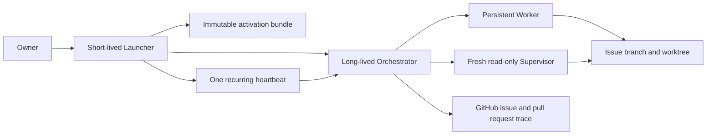
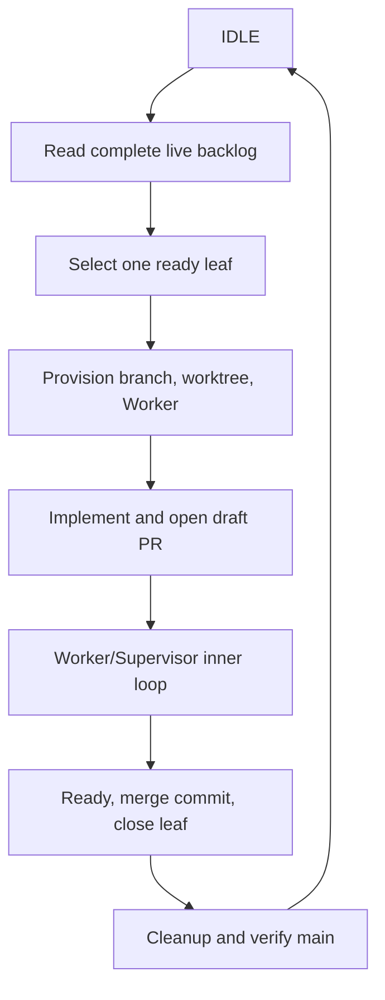

# Roundlet

Roundlet is a lightweight, prompt-native Codex skill for running one GitHub issue at a time through implementation, independent review, merge, closure, and cleanup. It uses Codex tasks, GitHub, Git worktrees, a small advisory local state, and one immutable activation-time contract bundle. It has no orchestration runtime, database, package, or release service.

## Contents

- [Architecture](#architecture)
- [Installation](#installation)
- [Target repository preparation](#target-repository-preparation)
- [Backlog preparation](#backlog-preparation)
- [Activation](#activation)
- [Operation](#operation)
- [Native Windows only](#native-windows-only)
- [Safety boundaries](#safety-boundaries)
- [Contributing](#contributing)

## Architecture


```mermaid
flowchart LR
    O["Owner"] --> L["Short-lived Launcher"]
    L --> C["Immutable activation bundle"]
    L --> R["Long-lived Orchestrator"]
    L --> H["One recurring heartbeat"]
    H --> R
    R --> W["Persistent Worker"]
    R --> S["Fresh read-only Supervisor"]
    W --> G["Issue branch and worktree"]
    S --> G
    R --> GH["GitHub issue and pull request trace"]
```

The outer loop continuously reconciles and schedules:


```mermaid
flowchart TD
    A["IDLE"] --> B["Read complete live backlog"]
    B --> C["Select one ready leaf"]
    C --> D["Provision branch, worktree, Worker"]
    D --> E["Implement and open draft PR"]
    E --> F["Worker/Supervisor inner loop"]
    F --> G["Ready, merge commit, close leaf"]
    G --> H["Cleanup and verify main"]
    H --> A
```

The inner loop keeps the same Worker and creates a fresh Supervisor for each attempt. A valid PASS ends review. Findings return to the same Worker. Invalid or unavailable Supervisor attempts use the next configured profile without consuming a review round.

GitHub issues and pull requests are durable scheduling/audit state. Local `.roundlet/` files are recovery pointers only. The Orchestrator is the sole GitHub writer.

## Installation

### Prerequisites

- Codex task creation, inspection, follow-up, wait, and archive controls.
- Recurring heartbeat creation, inspection, update, pause/resume, and removal.
- Git and an authenticated GitHub route with issue, pull request, branch, review/check, and merge access.
- Every exact model and reasoning effort in [`roundlet-config.json`](skills/roundlet/references/roundlet-config.json).
- The ability to read immutable creator-side task identity, model, effort, workspace/project, and canonical CWD.
- A clean authoritative local checkout for the target repository.

### Choose reviewed source

Use an exact reviewed Roundlet commit. The canonical installable directory is `skills/roundlet`; the repository root is not part of the installed skill.

Expected installable files:

```text
skills/roundlet/
├── SKILL.md
├── LICENSE
├── agents/
│   └── openai.yaml
└── references/
    ├── launcher.md
    ├── operator-guide.md
    ├── repository-authority.md
    ├── roundlet-config.json
    └── thread-prompts.md
```

Install that directory as `$CODEX_HOME/skills/roundlet` using the Codex skill installer workflow. Updating an existing installation does not update a live run: safely stop and clean that run first, install the reviewed source, then perform a completely fresh activation.

### Verify installation

Read the installed `SKILL.md` and all references. Validate:

- frontmatter and skill discovery;
- JSON and YAML parsing;
- exact configured role profiles;
- Supervisor profile count/name consistency;
- heartbeat interval arrays and full-reconciliation bound;
- review limits and merge method;
- owner allowlist;
- links and required file set;
- absence of executable orchestration artifacts.

## Target repository preparation

### Authoritative checkout

Before activation:

- origin and GitHub repository identity equal the intended `owner/repository`;
- default/primary branch is `main`;
- fetch completes;
- checkout is clean;
- `HEAD == main == origin/main`;
- no unrelated branch/worktree/task/heartbeat/run resource may own the target.

Roundlet never force-pushes, rebases, resets, bypasses branch protection, or destroys unique work.

### Repository authority

Copy the authority template from [`repository-authority.md`](skills/roundlet/references/repository-authority.md) into root `AGENTS.md` on authoritative `origin/main`. Keep exactly one valid block.

Authority switches can permit:

- ready conversion;
- merge;
- leaf closure;
- remote/local branch deletion;
- worktree removal.

They may narrow Roundlet but never override repository, host, or platform policy. Umbrella issues remain open.

### Local state exclusion

Add exactly:

```text
.roundlet/
```

to the authoritative checkout's local `.git/info/exclude`. Do not add it to committed `.gitignore`.

Roundlet may then keep:

- `.roundlet/lease.json`;
- `.roundlet/current.md`;
- `.roundlet/contracts/<contract-id>/`.

All are local-only. The bundle contains exact activation-time instructions and configuration; it is read-only after activation.

## Backlog preparation

Use formal GitHub parent/sub-issue relationships for membership. For each umbrella, keep a Canonical scheduling note describing priority, wave/order, exact runnable dependencies, and completion evidence.

Umbrellas are scheduling context only:

- never select an umbrella for implementation;
- never use its open/closed/completed state as a dependency;
- express dependencies only as exact leaf or standalone issue numbers;
- keep the umbrella open after a wave completes.

A runnable leaf provides live scope, boundaries, acceptance intent, and dependency evidence. Owner-only security, destructive, product-scope, release, or publication decisions remain explicit.

## Activation

Open [`launcher.md`](skills/roundlet/references/launcher.md#new-activation), fill only its placeholders, and create one Launcher directly against the authoritative checkout using the requested Launcher model/effort.

The Launcher:

1. verifies its immutable profile and writable checkout binding;
2. proves repository/GitHub/owner/authority/model/task/heartbeat/Git/filesystem/approval capabilities;
3. reconciles every old local/remote Roundlet resource and fails closed on stale ownership;
4. scans the complete backlog and Canonical scheduling notes without selecting an issue;
5. reserves a new run ID;
6. builds and reads back one immutable activation bundle;
7. creates and reads back advisory lease/current state;
8. creates exactly one configured Orchestrator and verifies its immutable task/profile/workspace/CWD binding;
9. requires exact `ACTIVATION_READY` without issue selection;
10. creates exactly one heartbeat bound only to the Orchestrator and requires exact `HEARTBEAT_BOUND`;
11. verifies all identities, sends one initial tick, reports the activation, and archives itself.

The Launcher never implements an issue and never owns the heartbeat.

## Operation

Routine instructions go to the existing Orchestrator and read only its pinned bundle. Do not invoke the installed `$roundlet` skill inside a live run.

Use the copyable prompts in [`operator-guide.md`](skills/roundlet/references/operator-guide.md#copyable-owner-commands) for:

- status inspection without advancing;
- pause;
- resume;
- stop-after-current;
- active-issue abort decisions.

If the original Orchestrator or heartbeat is inaccessible, use [`Explicit recovery`](skills/roundlet/references/launcher.md#explicit-recovery). Recovery uses the old bundle; it never imports an installed update.

### Scheduling and claim

On full reconciliation, Roundlet scans all open issues, formal relationships, blocking edges, canonical notes, labels, comments, active branches, and pull requests. It ranks ready leaf/standalone candidates by canonical order, priority, stated blocker-removal value, then oldest issue number.

Selection remains read-only while provisioning. The Orchestrator publishes selection only after branch, worktree, clean base, and persistent Worker identity read back correctly.

### Review and merge

- Rounds 1–3 are COMPLETE if reached; any valid PASS ends review.
- Rounds 4–10 are CONVERGING.
- Invalid Supervisor attempts do not consume the round.
- Round-10 findings get one final Worker repair without round 11 or a claimed PASS.
- Ready conversion and merge require live authority, correct exact SHA, successful required checks, mergeability, correct closing reference, and configured merge method `merge`.

### Cleanup

The same Worker performs read-only cleanup preflight. The Orchestrator then:

1. verifies merge/leaf/remote/worktree/unique-work state;
2. archives the Worker;
3. removes the linked worktree non-force when authorized;
4. verifies registration and physical path are absent;
5. deletes exact local/remote issue branches when authorized and safe;
6. fetches and fast-forwards authoritative `main`;
7. proves a clean `HEAD == main == origin/main`;
8. returns to IDLE or stops after current.

If ordinary worktree removal fails, diagnose the exact holder and preserve evidence. Never kill Codex or Node, force-remove unknown work, or broaden the cleanup target.

### Skill updates

A live run remains pinned even when the installed skill changes. The supported update sequence is:

1. stop-after-current (or stop immediately while IDLE);
2. verify heartbeat, roles, branches, worktrees, advisory state, and bundle cleanup;
3. install the reviewed new skill;
4. start a completely fresh run with a new run ID and contract.

There is no in-place update path.

## Native Windows only

These rules apply only to a verified native-Windows Worker:

- Create the task with a unique host-owned anchor as canonical CWD.
- Place the removable linked worktree at a distinct writable descendant path; never make the Worker CWD equal to or inside that worktree.
- Use direct normal-sandbox `apply_patch` for source edits. Do not wrap or elevate it through PowerShell, shell pipelines, here-strings, or batch files.
- If linked-worktree Git metadata is outside normal writable roots, request only the narrowest approval for the exact Git metadata operation.
- A host process retaining the separate anchor CWD is not a holder of the child worktree.
- A surviving empty host-owned anchor is host lifecycle evidence, not an active Roundlet worktree.

WSL, Linux, macOS, and other hosts keep their ordinary topology and must not inherit these exceptions.

## Safety boundaries

- Every run reads one immutable activation bundle.
- Installed drift never silently changes a live run.
- Every task is bound once at creation to immutable task ID, profile, project/workspace, and CWD.
- GitHub is the durable trace; local files never override live Git/GitHub evidence.
- Lightweight observations never authorize mutation.
- Only one active leaf and Worker exist per run.
- Only the Orchestrator mutates GitHub.
- Supervisors are fresh and read-only.
- Merge, closure, branch deletion, and worktree removal require live authority.
- Cleanup never destroys unique work.
- Release, tag, publish, version bump, repository visibility change, force-push, reset, rebase, and runtime self-promotion remain out of scope.

## Contributing

Repository policy is in [`AGENTS.md`](AGENTS.md).

For every skill change:

1. create an isolated `codex/` worktree/branch;
2. keep the change focused and prompt-native;
3. synchronize affected references and this README;
4. avoid new runtimes, helpers, CI, generated artifacts, or duplicate guides;
5. run the current system `skill-creator/scripts/quick_validate.py skills/roundlet`;
6. parse JSON/YAML and check links, source layout, prohibited artifacts, Markdown fences, and `git diff --check`;
7. independently review the exact candidate;
8. when mutation behavior changes, run one owner-authorized complete forward cycle through Launcher, Orchestrator, Worker, Supervisor, draft PR, ready, merge commit, leaf close, and cleanup;
9. use a focused draft PR, merge commit, and ordered branch/worktree cleanup.
