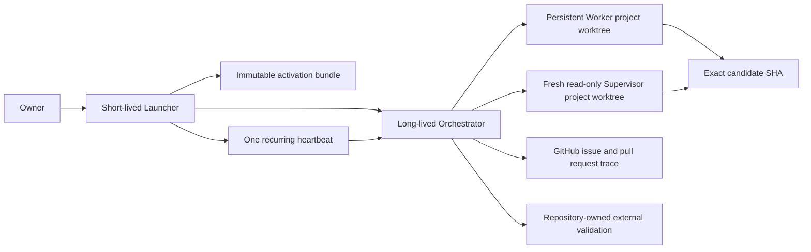
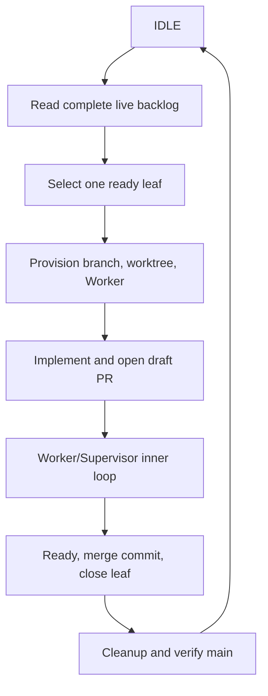

# Roundlet

Roundlet is a lightweight, prompt-native Codex skill for running one GitHub issue at a time through implementation, independent review, merge, closure, and cleanup. It uses Codex tasks, GitHub, Git worktrees, a small advisory local state, and one immutable activation-time contract bundle. It has no orchestration runtime, database, package, or release service.

## Contents

- [Architecture](#architecture)
- [Installation](#installation)
- [Target repository preparation](#target-repository-preparation)
- [Backlog preparation](#backlog-preparation)
- [Activation](#activation)
- [Operation](#operation)
- [Native Windows only](#native-windows-only)
- [Safety boundaries](#safety-boundaries)
- [Contributing](#contributing)

## Architecture


```mermaid
flowchart LR
    O["Owner"] --> L["Short-lived Launcher"]
    L --> C["Immutable activation bundle"]
    L --> R["Long-lived Orchestrator"]
    L --> H["One recurring heartbeat"]
    H --> R
    R --> W["Persistent Worker project worktree"]
    R --> S["Fresh read-only Supervisor project worktree"]
    W --> X["Exact candidate SHA"]
    S --> X
    R --> GH["GitHub issue and pull request trace"]
    R --> EV["Repository-owned external validation"]
```

The outer loop continuously reconciles and schedules:


```mermaid
flowchart TD
    A["IDLE"] --> B["Read complete live backlog"]
    B --> C["Select one ready leaf"]
    C --> D["Provision branch, worktree, Worker"]
    D --> E["Implement and open draft PR"]
    E --> F["Worker/Supervisor inner loop"]
    F --> G["Ready, merge commit, close leaf"]
    G --> H["Cleanup and verify main"]
    H --> A
```

The inner loop keeps the same Worker task and App-managed worktree for implementation and repairs. Each review attempt gets a fresh, separate read-only Supervisor worktree. They share repository identity and the exact full candidate SHA, not a physical directory. A valid PASS ends review. Findings return to the same Worker. Invalid or unavailable Supervisor attempts use the next configured profile without consuming a review round.

GitHub issues and pull requests are durable scheduling/audit state. Local `.roundlet/` files are recovery pointers only. The Orchestrator is the sole GitHub writer. The authoritative routing matrix is in [`operator-guide.md`](skills/roundlet/references/operator-guide.md#canonical-destination-matrix): selection, owner/scope, initial Worker, and draft-PR events stay on the issue; post-PR candidate, validation, repair, and review evidence uses the top-level PR Conversation; merge state comes from the PR; leaf lifecycle and cleanup return to the issue. Every write is read back from the same selected surface, and ambiguous retries search both conversations for the stable event marker first.

## Installation

### Prerequisites

- Codex task creation, inspection, follow-up, wait, and archive controls.
- A uniquely resolvable saved local Git project for the authoritative checkout, plus asynchronous App-managed project/worktree task creation. Repository Workers and Supervisors never rely on projectless output-directory hints as CWD routing.
- Recurring heartbeat creation, inspection, update, pause/resume, and removal.
- Git and an authenticated GitHub route with issue, pull request, branch, review/check, and merge access.
- Every exact model and reasoning effort in [`roundlet-config.json`](skills/roundlet/references/roundlet-config.json).
- The creator's ability to read immutable task identity, creator/source task, configured model/effort, workspace/project, canonical CWD, and available stable host/environment identity independently of role output, then transport the resulting complete attestation into a top-level Launcher prompt. The Launcher role itself does not need an immutable self-metadata route.
- The creator's ability to resolve the reviewed installed Roundlet skill to one canonical absolute root and place it in the populated Launcher prompt. The Launcher reads only that path and does not depend on the skill appearing in its role-side catalog.
- A clean authoritative local checkout for the target repository.
- When the target explicitly declares a validation-toolchain contract, any system-discoverable bootstrap interpreter satisfying that repository's stated version. It invokes only the repository resolver and is not build/test evidence.

### Choose reviewed source

Use an exact reviewed Roundlet commit. The canonical installable directory is `skills/roundlet`; the repository root is not part of the installed skill.

Expected installable files:

```text
skills/roundlet/
├── SKILL.md
├── LICENSE
├── agents/
│   └── openai.yaml
└── references/
    ├── launcher.md
    ├── operator-guide.md
    ├── repository-authority.md
    ├── roundlet-config.json
    └── thread-prompts.md
```

Install that directory as `$CODEX_HOME/skills/roundlet` using the Codex skill installer workflow. Updating an existing installation does not update a live run: safely stop and clean that run first, install the reviewed source, then perform a completely fresh activation.

### Verify installation

Read the installed `SKILL.md` and all references. Validate:

- frontmatter and skill discovery;
- JSON and YAML parsing;
- exact configured role profiles;
- distinct non-authoritative role-report and creator-authoritative binding-attestation contracts;
- Supervisor profile count/name consistency;
- heartbeat interval arrays and full-reconciliation bound;
- review limits and merge method;
- owner allowlist;
- generic external-validation routes and the two independent Boolean authority switches;
- optional repository-owned lifecycle-observation contract selection with zero behavior when not selected;
- links and required file set;
- absence of executable orchestration artifacts.

## Target repository preparation

### Authoritative checkout

Before activation:

- origin and GitHub repository identity equal the intended `owner/repository`;
- default/primary branch is `main`;
- fetch completes;
- checkout is clean;
- `HEAD == main == origin/main`;
- no unrelated branch/worktree/task/heartbeat/run resource may own the target.

Roundlet never force-pushes, rebases, resets, bypasses branch protection, or destroys unique work.

### Repository authority

Copy the authority template from [`repository-authority.md`](skills/roundlet/references/repository-authority.md) into root `AGENTS.md` on authoritative `origin/main`. Keep exactly one valid block.

Authority switches can permit:

- repository-owned read-only external validation;
- exact allowlisted mutation in a repository-owned disposable target;
- ready conversion;
- merge;
- leaf closure;
- remote/local branch deletion;
- worktree removal.

They may narrow Roundlet but never override repository, host, or platform policy. Umbrella issues remain open.

### Local state exclusion

Add exactly:

```text
.roundlet/
```

to the authoritative checkout's local `.git/info/exclude`. Do not add it to committed `.gitignore`.

Roundlet may then keep:

- `.roundlet/lease.json`;
- `.roundlet/current.md`;
- `.roundlet/contracts/<contract-id>/`;
- `.roundlet/validation-tools/` when the target repository declares it as a shared validation cache.

A repository may separately declare a retained lifecycle-evidence boundary. Its sealed ledgers survive task/worktree cleanup but are not part of the Roundlet activation bundle or ordinary run-owned state.

All are local-only. The bundle contains exact activation-time instructions and configuration; it is read-only after activation. A validation cache is separate host-owned reusable state: it is not part of the bundle, does not indicate a live run, and survives ordinary issue/run cleanup.

## Backlog preparation

Use formal GitHub parent/sub-issue relationships for membership. For each umbrella, keep a Canonical scheduling note describing priority, wave/order, exact runnable dependencies, and completion evidence.

Umbrellas are scheduling context only:

- never select an umbrella for implementation;
- never use its open/closed/completed state as a dependency;
- express dependencies only as exact leaf or standalone issue numbers;
- keep the umbrella open after a wave completes.

A runnable leaf provides live scope, boundaries, acceptance intent, and dependency evidence. When authoritative root instructions declare external validation, it also provides exactly one generic route: `none`, `toolbox`, or `toolbox+disposable-target`; without such a contract Roundlet binds `none`. A leaf that requires ephemeral lifecycle capture also declares its arm-before boundary and selects one exact root-referenced repository-owned sink; every other leaf binds `NOT_SELECTED`. Concrete toolbox/target repositories, exact commits, sink implementation/storage, actions, rollback, evidence time, and read-back remain in authoritative target-repository instructions or a referenced repository-owned skill; they never become Roundlet-specific core policy. Owner-only security, destructive, product-scope, release, or publication decisions remain explicit.

## Activation

Open [`launcher.md`](skills/roundlet/references/launcher.md#new-activation), resolve the reviewed installed skill to one canonical absolute root, fill only the explicit placeholders, and create one Launcher directly against the authoritative checkout using the requested Launcher model/effort.

The Launcher receives one complete creator-verified binding attestation and the exact installed-skill root in its populated prompt, validates both without role-side immutable self-metadata or skill-catalog discovery, and binds the root's exact seven-file identity map before repository access and again around bundle materialization, then:

1. validates the creator-attested immutable profile and writable-checkout binding;
2. proves repository/GitHub/owner/authority/model/task/heartbeat/Git/filesystem/approval capabilities, including one metadata-only project/worktree route probe with detached exact-SHA read-back and a terminal cleanup receipt produced only after the combined task/registration/path predicate settles or its activation-pinned cleanup bound (120 seconds in the reviewed configuration) expires, before any run ID exists;
3. discovers and checks any explicitly declared repository validation-toolchain capability, external-validation contract, and optional lifecycle-observation contract path/blob identities without provisioning or invoking them;
4. reconciles every old local/remote Roundlet resource and fails closed on stale ownership;
5. scans the complete backlog and Canonical scheduling notes without selecting an issue;
6. reserves a new run ID;
7. builds and reads back one immutable activation bundle;
8. creates and reads back advisory lease/current state;
9. creates exactly one configured Orchestrator and records its creator-authoritative task-binding attestation independently of any role metadata report;
10. requires exact `ACTIVATION_READY` without issue selection;
11. creates exactly one heartbeat bound only to the Orchestrator and requires exact `HEARTBEAT_BOUND`;
12. verifies all identities, sends one initial tick, reports the activation, and archives itself.

The Launcher never implements an issue and never owns the heartbeat.

## Operation

Routine instructions go to the existing Orchestrator and read only its pinned bundle. Do not invoke the installed `$roundlet` skill inside a live run.

Use the copyable prompts in [`operator-guide.md`](skills/roundlet/references/operator-guide.md#copyable-owner-commands) for:

- status inspection without advancing;
- pause;
- resume;
- stop-after-current;
- active-issue abort decisions.

If the original Orchestrator or heartbeat is inaccessible, use [`Explicit recovery`](skills/roundlet/references/launcher.md#explicit-recovery). Recovery uses the old bundle; it never imports an installed update.

### Scheduling and claim

On full reconciliation, Roundlet scans all open issues, formal relationships, blocking edges, canonical notes, labels, comments, active branches, and pull requests. It ranks ready leaf/standalone candidates by canonical order, priority, stated blocker-removal value, then oldest issue number.

Selection remains read-only while provisioning. The Orchestrator resolves the unique saved project, creates an unpublished candidate ref, and creates the persistent Worker through the App-managed project/worktree task route. It publishes and reads back selection on the leaf issue only after detached `HEAD`, actual worktree CWD, canonical Git common directory, exact starting SHA, non-reuse of retained tombstones, clean base, and Worker identity read back correctly.

### Review and merge

- Review mode is derived only from the activation-pinned config: rounds through `review.complete_rounds` are COMPLETE, and later rounds through `review.max_rounds` are CONVERGING. It is never selected or recovered independently.
- Invalid Supervisor attempts do not consume the round.
- Before creating a Supervisor, the Orchestrator semantically reads back the exact initial-candidate basis or, after FINDINGS, the accepted result, same-Worker repair, remote head, and canonical candidate-movement trace. Missing or conflicting evidence remains pending and creates no review task.
- Every Supervisor starts in a fresh detached worktree at the exact candidate. The Orchestrator independently requires matching clean pre/post worktree and exact-candidate-ref snapshots, excluding unrelated refs in the shared common directory; the Supervisor's own `read_only` claim is not proof.
- After creator metadata exists and immediately before review work, the Orchestrator validates one fully populated shared envelope, dispatch attestation, review block, and required structured-result schema. Marker, placeholder, task/profile, tuple/mode, repository, leaf, PR, base, candidate, and trace mismatches return to reconciliation without consuming review accounting.
- A valid FINDINGS consumes its formal round. After the same Worker repairs and the candidate changes, review continues in the same epoch at the next round's attempt 1; a changed candidate is never a fallback attempt in the prior round.
- Repository-owned external-validation sequence values remain separate from the formal Supervisor epoch/round/attempt. They cannot dispatch a Supervisor, satisfy review, or enter the merge gate. A misbound review is interrupted before verdict acceptance or trace and is recreated at the correct formal tuple.
- A selected lifecycle-observation window remains separate from formal review accounting and must be sealed/verified for the terminal candidate before its evidence can satisfy a merge gate.
- Supervisor-result and Worker-repair-handoff traces must be published and read back on the canonical surface before review state advances. A retryable missing trace remains pending rather than becoming owner input.
- Pause, resume, same-task continuation, authorized recovery, and satisfaction of an already-declared standing validation route preserve the same epoch and accepted-round count when scope, acceptance criteria, immutable contract, and candidate review basis are unchanged.
- Only a material owner scope/acceptance change or main integration starts a new COMPLETE epoch.
- Round-10 findings get one final Worker repair without round 11 or a claimed PASS.
- Ready conversion and merge require live authority, correct exact SHA, successful required checks, mergeability, correct closing reference, and configured merge method `merge`.

### Repository-defined validation toolchains

If root instructions explicitly name a validation-toolchain contract, Roundlet binds affected validation to it. On first required validation, the Worker uses the candidate resolver and lock with the authoritative checkout's shared `.roundlet/validation-tools/` cache root. A valid receipt is verified and reused; a wholly absent exact cache is provisioned automatically. Partial, stale, invalid, moved, or drifted evidence blocks without fallback or automatic rebuild.

The host may discover a suitable bootstrap interpreter, but it only invokes the resolver. Actual build, test, packaging, and smoke commands run through the receipt-bound environment. Repositories without an explicit contract keep ordinary proportional validation.

### Repository-owned external validation

When root instructions declare it, Roundlet resolves a selected leaf's generic route against exact authoritative instruction/skill blobs and repository-owned identities. Read-only execution requires `allow_external_validation_read_only: true`; a disposable-target mutation also requires `allow_external_validation_disposable_target_mutation: true`, an exact action allowlist, rollback, and semantic read-back. Matching standing authority avoids repetitive per-attempt owner prompts. Credential failure, identity conflict, an out-of-scope action, or partial mutation still stops for owner input.

The selected repository also supplies one exact executor contract. Roundlet treats its command, schemas, product adapters, recording, retention, and receipts as opaque; it never builds a candidate-specific runner. Readiness/result schema identities are derived from the exact selected contract and typed receipts, never copied from an earlier binding. The generic lifecycle is `UNPREPARED -> PREFLIGHT_READY -> ARMED -> EXECUTED -> VERIFIED`, with `STALE` on any candidate or component movement. External-action-free preflight defects return to implementation without a LIVE trace, external dispatch, review-round change, or owner prompt. One readiness trace is published only when the plan is actually executable, and one result trace only after semantic verification.

Historical replay always uses the evidence bundle's repository-declared capture time. It never substitutes the replay execution wall clock. Public trace contains only the allowed exact identities, digests, typed result, and read-back projection.

### Optional lifecycle observation sink

Repositories may opt a specific leaf into transition-time evidence capture. Roundlet binds the exact authoritative sink contract and arms one candidate/review/window before the leaf's first declared ephemeral event. Only the Orchestrator invokes the repository-owned prepare, append/read-back, and seal/verify paths; Worker and Supervisor tasks never write the sink.

The generic event surface distinguishes role-attempt start/completion, cancellation or invalid context, PASS/FINDINGS, accepted/unaccepted result, candidate movement, and formal-round advancement. It carries only opaque public-safe identities, exact candidate/review tuple, immutable event time, predecessor, and bounded artifact digests. Raw provider output, credentials, private paths, transcripts, hidden reasoning, and product-only fields are prohibited.

Each append receipt is read back before Roundlet advances that transition. Candidate, formal tuple, producer, store, schema, capture plan, window, time, predecessor, or receipt movement makes the window stale. A missed pre-arm event requires a fresh live window; Roundlet never reconstructs it. Repositories that do not select a sink have no sink storage, calls, approval, or lifecycle overhead.

### Cleanup

The same Worker performs read-only cleanup preflight. The Orchestrator then:

1. reads the live merge/leaf identities, fetches exact remote main and issue refs, and proves the merge commit locally before ancestry review;
2. verifies merge/leaf/remote/Worker-worktree/unique-work state through the same Worker;
3. archives the Worker, observes the combined task/registration/path cleanup predicate for at most the activation-pinned `cleanup.settlement_seconds` value, stops immediately when cleanup succeeds, and appends exactly one terminal task-worktree cleanup result with the pinned bound, actual elapsed wait, and observation count;
4. consumes the run-local cleanup ledger for every Worker and Supervisor, inventories every Orchestrator-created auxiliary worktree/state root, and hash-retains unique evidence-bearing artifacts under the repository-declared retention boundary;
5. removes any remaining exact linked-worktree registrations non-force only after unique-work and retention proof;
6. verifies registrations and physical paths are absent, or records a strictly empty, unregistered, no-`.git`, archived/non-active App-managed path as a typed local tombstone when the bounded cleanup-settlement observation reaches that complete predicate;
7. deletes exact local/remote issue branches when authorized and safe;
8. fetches and fast-forwards authoritative `main`;
9. proves a clean `HEAD == main == origin/main`;
10. retains issue evidence, every sealed or diagnostic lifecycle window, and any repository-declared shared validation cache;
11. returns to IDLE or stops after current.

Task archival is not itself cleanup completion: Codex App may remove registration and path state asynchronously. Interim read-only observations are nonterminal; Roundlet records only the final combined snapshot when removal/tombstone succeeds or the deadline expires. If ref refresh, retention, registration removal, a non-empty path, or any ownership/read-back check remains unresolved at that deadline, stop cleanup, diagnose the exact conflict, and preserve evidence. A verified typed empty task-worktree tombstone is local host-lifecycle evidence and does not block the next issue; it is never reused or silently forgotten. Never infer ancestry, kill Codex or Node, force-remove unknown work, or broaden the cleanup target.

### Skill updates

A live run remains pinned even when the installed skill changes. The supported update sequence is:

1. stop-after-current (or stop immediately while IDLE);
2. verify heartbeat, roles, branches, worktrees, advisory state, and bundle cleanup;
3. install the reviewed new skill;
4. start a completely fresh run with a new run ID and contract.

There is no in-place update path.

## Native Windows only

These rules apply only to a verified native-Windows Worker:

- Use the verified App-managed project worktree as both canonical CWD and implementation worktree; do not create a manual per-task anchor or nested linked worktree.
- Use direct normal-sandbox `apply_patch` for source edits. Do not wrap or elevate it through PowerShell, shell pipelines, here-strings, or batch files.
- If linked-worktree Git metadata is outside normal writable roots, request only the narrowest approval for the exact Git metadata operation.
- After archival, a locked path is non-blocking only when the typed tombstone rule proves it unregistered, without `.git`, and exactly empty. Any content or ambiguity blocks cleanup.

WSL, Linux, macOS, and other hosts use the same repository project/worktree topology but do not inherit these Windows mutation-route exceptions.

## Safety boundaries

- Every run reads one immutable activation bundle; Git-sourced bundles use exact commit-object bytes, not filterable checkout bytes.
- Repository-declared validation uses candidate/lock/receipt-bound tools; a discovered bootstrap interpreter cannot satisfy validation evidence, and the shared cache is retained separately from run state.
- Installed drift never silently changes a live run.
- Every task has at most one creator-authoritative binding attestation covering immutable task ID, creator/source task, requested role, profile, project/workspace, CWD, and available stable host/environment identity. The external creator transports the top-level Launcher's complete attestation in its populated prompt; later creators copy child attestations into their role envelopes and advisory state. Role metadata reports are advisory and cannot satisfy, alter, or invalidate that binding.
- GitHub is the durable trace; local files never override live Git/GitHub evidence.
- Lightweight observations never authorize mutation.
- Only one active leaf and Worker exist per run.
- Only the Orchestrator mutates GitHub.
- Supervisors are fresh and read-only.
- Merge, closure, branch deletion, and worktree removal require live authority.
- External validation requires exact repository-owned route/identity/action/evidence-time bindings and the matching independent authority switch; no route authorizes an unknown or production target.
- Executor schema expectations come only from the exact selected contract and typed receipts; opaque external-validation sequence values never replace formal Supervisor accounting.
- Lifecycle observation is opt-in, Orchestrator-only, append/read-back before advancement, and sealed/verified before evidence acceptance; missing pre-arm history is never reconstructed.
- Cleanup never destroys unique work.
- Cleanup never removes unique auxiliary evidence before exact size/digest retention and read-back.
- Release, tag, publish, version bump, repository visibility change, force-push, reset, rebase, and runtime self-promotion remain out of scope.

## Contributing

Repository policy is in [`AGENTS.md`](AGENTS.md).

For every skill change:

1. create an isolated `codex/` worktree/branch;
2. keep the change focused and prompt-native;
3. synchronize affected references and this README;
4. avoid new runtimes, helpers, CI, generated artifacts, or duplicate guides;
5. run the current system `skill-creator/scripts/quick_validate.py skills/roundlet`;
6. parse JSON/YAML and check links, source layout, prohibited artifacts, Markdown fences, and `git diff --check`;
7. independently review the exact candidate;
8. when mutation behavior changes, run one owner-authorized complete forward cycle through Launcher, Orchestrator, Worker, Supervisor, draft PR, ready, merge commit, leaf close, and cleanup;
9. use a focused draft PR, merge commit, and ordered branch/worktree cleanup.
